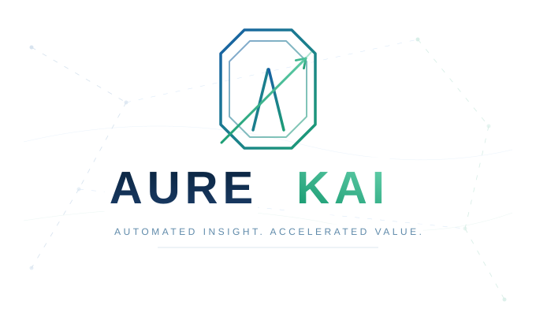

<p align="center">
  
</p>

# Aurekai

**Aurekai is the operating fabric for intelligent work, built on the Akai native runtime with compatibility for the Bonfyre runtime lineage.**

Aurekai is not a wrapper around LLMs. It is a native AI operations runtime exposed through MCP, LLM tool calling, workflow engines, agent frameworks, data systems, CI/CD, infrastructure templates, and IDEs, with real commands for media, models, memory, proof, commerce, telephony, network events, reasoning, publishing, and client delivery.

Every run emits proof, lineage, metering, cache, feature, and artifact metadata.

```bash
bun add -g @aurekai/runtime
akai doctor --deep
```

## Quick start

```bash
akai --help
akai doctor --deep
akai install --user
akai dashboard
akai run recipe.json --sae-audit --semantic-cache
```

## What Aurekai includes

- **Runtime** — execution, routing, queue management, workflow dispatch, and release gates
- **Commerce** — auth, gate issuance, metering, invoicing, ledger, CMS, and client outreach
- **Intake** — file ingest, media normalization, transcription, segmentation, frame extraction, and speech loop
- **Memory** — `.akmodel`, `.aksae`, `.akfpqx`, FPQ compression, FPQx alignment, SAE activation, vector search, KV cache
- **Proof** — Merkle graph, lineage, equivalence indexing, SBOM, checksums, and proof bundle assembly
- **Reason** — reasoning sessions, branching, diff, physics trajectories, and learning feedback
- **Wire** — telephony simulation, PCAP ingest, wire probing/reporting, MoQ relay, and network seal/eval
- **Publish** — brief generation, narration, deliverable packing, clip extraction, and distribution
- **Substrate** — capability registry, space management, time scheduling, compression, and hardening tests

The capability registry is the source of truth: [`registry/aurekai.capabilities.json`](./registry/aurekai.capabilities.json)

## Public packages

| Surface      | Package                                                                          |
|--------------|----------------------------------------------------------------------------------|
| npm          | [`@aurekai/runtime`](https://www.npmjs.com/package/@aurekai/runtime)             |
| PyPI         | [`aurekai`](https://pypi.org/project/aurekai/)                                   |
| JSR          | [`@aurekai/sdk`](https://jsr.io/@aurekai/sdk)                                    |
| Homebrew     | `aurekai/homebrew-tap`                                                            |
| Open VSX     | `aurekai-workbench`                                                               |
| MCP          | [`@aurekai/mcp`](https://www.npmjs.com/package/@aurekai/mcp)                     |
| Hugging Face | `aurekai/model-memory`, `aurekai/sae-dictionaries`, `aurekai/fpqx-alignments`    |

See the latest [GitHub Release](https://github.com/aurekai/aurekai/releases) for platform binaries, manifests, SBOM, and checksums.

## Ecosystem integrations

Aurekai maintains active integration surfaces across LLM providers, agent frameworks, workflow orchestrators, data/ML tools, infrastructure platforms, IDE/dev environments, MCP, package managers, and model-memory registries.

Each integration is a **host-native adapter over the Akai runtime** — not a wrapper. Every integration declares which capability families it exposes, which native Akai commands it binds, which platform-native primitives it exploits, and which proof/lineage/metering artifacts it emits.

See [`registry/integrations.json`](./registry/integrations.json) and [`ECOSYSTEM_NAMES.md`](./ECOSYSTEM_NAMES.md) for the full matrix.

## Deep integrations

Aurekai integrations are capability-native adapters over the Akai runtime, not thin shell wrappers.

See:
- [`registry/integrations.json`](./registry/integrations.json)
- [`registry/aurekai.capabilities.json`](./registry/aurekai.capabilities.json)

### LLM providers

OpenAI · Anthropic · Gemini · Mistral · Groq · xAI · Perplexity · Cohere · local Llama stacks · Gateway · Evals

### Agent frameworks

LangChain · LlamaIndex · Haystack · Semantic Kernel · AutoGen · CrewAI

### Workflow and orchestration

Kestra · Airflow · Prefect · Dagster · Temporal · n8n · Node-RED · GitHub Actions · GitLab CI · Argo Workflows · Tekton

### Data and ML

MLflow · W&B · DVC · DuckDB · SQLite · PostgreSQL

### Infrastructure and developer environments

Terraform · Pulumi · Helm · Kubernetes · Nix · VS Code · Open VSX · Dev Containers · Codespaces · Gitpod

## Capability architecture

```
Akai Native Runtime
  → Aurekai Capability Registry  (registry/aurekai.capabilities.json)
  → Generated tool/workflow/schema bindings
  → Deep integrations for workflow engines, CI/CD, infra, IDEs, data/ML, MCP, agent frameworks, LLM providers
  → Every run emits proof, lineage, metering, cache, feature, and artifact metadata
```

Capability families and their primary commands:

| Family       | Key commands                                                        |
|--------------|---------------------------------------------------------------------|
| `runtime`    | `runtime.capabilities`, `control.route`, `queue.enqueue`, `tier.route`, `workflow.run` |
| `commerce`   | `gate.issue`, `meter.record`, `pay.invoice`, `ledger.export`, `outreach.followup` |
| `intake`     | `ingest.file`, `transcribe.audio`, `segment.speakers`, `frame_extract.video`, `speech_loop.transform` |
| `memory`     | `model.pull`, `fpq.compress`, `fpqx.align`, `sae.activate`, `vec.search`, `kvcache.chain` |
| `proof`      | `canon.hash`, `graph.lineage`, `graph.merkle`, `index.equivalence`, `proof.bundle` |
| `reason`     | `reason.start`, `reason.branch`, `physics.run`, `flow.branch`, `learn.feedback` |
| `wire`       | `tel.sim_call`, `wire.ingest_pcap`, `wire.report`, `moq.video_relay`, `net.seal` |
| `publish`    | `brief.generate`, `narrate.brief`, `pack.deliverable`, `clips.extract`, `distribute.bundle` |
| `substrate`  | `capability.registry`, `space.put`, `time.schedule`, `compress.family`, `violence.coupling_test` |

Validation: `node scripts/validate-capability-bindings.mjs`

## Formats

### Aurekai-first

| Format     | Purpose                              |
|------------|--------------------------------------|
| `.akmodel` | model weight pack                    |
| `.aksae`   | SAE feature dictionary               |
| `.akfpqx`  | cross-model FPQx alignment manifest  |

### Legacy-compatible

| Format     | Alias      |
|------------|------------|
| `.bfmodel` | `.akmodel` |
| `.bfsae`   | `.aksae`   |
| `.bffpqx`  | `.akfpqx`  |

## Manifest bridge

Every Aurekai release includes:

| Manifest                | Purpose                                  |
|-------------------------|------------------------------------------|
| `aurekai.manifest.json` | public distribution metadata             |
| `bonfyre.manifest.json` | native runtime compatibility validation  |

This is not a bug. It is the bridge.

## CLI

```bash
akai doctor --deep
akai dashboard
akai run <recipe> [--input FILE] [--sae-audit] [--semantic-cache]
akai install --user
akai sae:activate --dict default.aksae --residual residual.bin
akai model:inspect qwen3-8b.akmodel
akai fpqx:align-sae --from qwen3-8b.l24.aksae --to llama3-8b.l26.aksae --out qwen3-to-llama3.akfpqx
akai query:features "feature:6159 > 0.7"
```

Compatibility aliases remain during migration:

```
bonfyre       -> akai
bonfyre-hyper -> akai
bonfyre-sae   -> akai sae
```

## Native runtime lineage

Aurekai is the public platform for intelligent-work automation, built on a native runtime lineage originally developed under the Bonfyre codename.

The native runtime is tracked separately: [https://github.com/aurekai/native-runtime](https://github.com/aurekai/native-runtime)

See [`COMPATIBILITY.md`](./COMPATIBILITY.md) and [`MIGRATION.md`](./MIGRATION.md) for migration mechanics, dual-manifest rules, and `.bf*` format support.

## License

Aurekai code and tooling are licensed under Apache-2.0.

Model-memory artifacts, SAE dictionaries, FPQx alignments, and benchmark assets may carry additional upstream model or dataset terms. See each artifact manifest.

